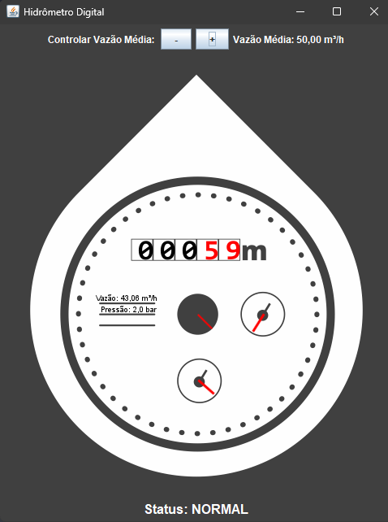
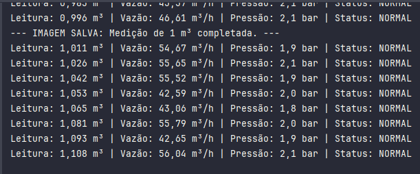
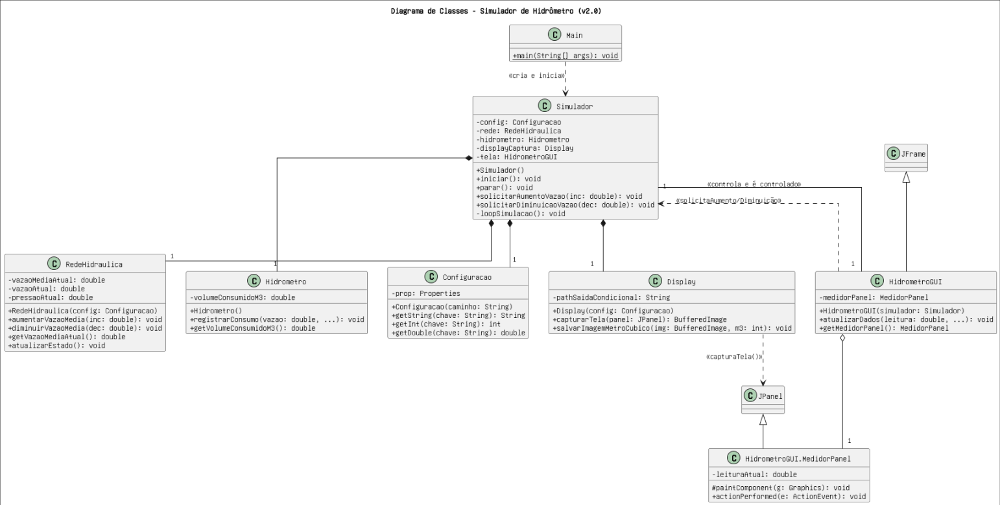

# Simulador de Hidrômetro em Java (v2.0)

   

## 📖 Visão Geral

Este projeto é um **Simulador de Hidrômetro Digital Interativo** desenvolvido em Java. O objetivo é fornecer uma representação visual e funcional de um hidrômetro, permitindo que o usuário **controle a vazão de água em tempo real** sem interromper a execução.

O simulador carrega configurações de um arquivo de propriedades, opera de forma contínua com uma lógica de simulação em uma thread separada, e exibe os dados em uma interface gráfica (GUI) que imita um medidor real. A principal funcionalidade desta versão é o **salvamento automático de medições**: o sistema captura uma imagem da GUI a cada metro cúbico (m³) de água consumido e a organiza em um diretório específico, criando um histórico visual das medições.

## ✨ Funcionalidades Principais

-   **Controle Interativo da Vazão:** O usuário pode aumentar ou diminuir a vazão média da água através de botões na interface, e a simulação se ajusta instantaneamente.
-   **Salvamento Condicional de Medições:** A cada metro cúbico (m³) completado, uma imagem (`.jpeg`) do estado exato do medidor é salva automaticamente.
-   **Interface Gráfica com Animações:** Exibe a leitura, vazão e pressão em um painel visual que imita um hidrômetro real, com ponteiros animados.
-   **Organização de Arquivos:** As medições salvas são organizadas em um diretório com nome customizável (`Medições_[Matrícula]`). Os arquivos de imagem são nomeados ciclicamente de `01.jpeg` a `99.jpeg`.
-   **Simulação de Eventos:** Modela eventos aleatórios como **Falta de Água** e **Presença de Ar na Tubulação**, com feedback visual e no console.
-   **Configuração Externa:** Parâmetros da simulação (vazão inicial, matrícula, etc.) são ajustáveis via arquivo `.properties`.
-   **Log de Console:** Gera logs detalhados no console, mostrando o estado da rede a cada ciclo.

---

## 💻 Saídas do Simulador (Exemplos)

### Interface Gráfica (GUI)

A simulação é exibida em tempo real, incluindo o novo painel de controle para ajustar a vazão média.



### Arquivos Salvos

A cada m³ completado, uma imagem é salva no diretório `Medições_[SuaMatricula]`, com nomes de arquivo que se repetem após 99, sobrescrevendo os antigos.

```
Medições_202310980012/
├── 01.jpeg  (salvo quando a leitura atingiu 1 m³)
├── 02.jpeg  (salvo quando a leitura atingiu 2 m³)
...
└── 99.jpeg  (salvo quando a leitura atingiu 99 m³)
(quando atingir 100 m³, o arquivo 01.jpeg será sobrescrito)
```

### Saída do Console

O console exibe logs detalhados, incluindo as notificações de salvamento de imagem e os ajustes manuais de vazão.



---

## 🛠️ Tecnologias Utilizadas

-   **Java 11+**
-   **Java Swing** para a Interface Gráfrica
-   **Apache Maven** para gerenciamento do projeto

---

## 📂 Estrutura do Projeto

```
simulador-hidrometro/
├── docs/
│   └── images/
│       └── gui_exemplo.png
├── Medições_202310980012/  <-- Diretório de saída criado em tempo de execução
│   ├── 01.jpeg
│   └── ...
├── src/
│   ├── main/
│   │   ├── java/
│   │   │   └── br/com/hidrometro/
│   │   └── resources/
│   │       ├── config/
│   │       │   └── parametros.properties
│   │       └── hidrometro.png
└── README.md
```

---

## 🚀 Como Executar o Projeto

### Pré-requisitos

-   **Java Development Kit (JDK)** - Versão 11 ou superior.
-   **IntelliJ IDEA** (ou outra IDE com suporte a Maven).

### Passos para Execução

1.  **Clone o Repositório:**
    ```bash
    git clone [URL_DO_SEU_REPOSITORIO] simulador-hidrometro
    ```
2.  **Abra no IntelliJ IDEA:** A IDE detectará o arquivo `pom.xml` e configurará o projeto.
3.  **Configure a Simulação:**
    -   Abra o arquivo `src/main/resources/config/parametros.properties`.
    -   **Importante:** Altere o valor da chave `matricula.suap` para a sua matrícula.
4.  **Execute:**
    -   Encontre e execute o método `main` na classe `Main.java`.
5.  **Observe e Interaja:**
    -   A janela da GUI será exibida.
    -   Use os botões `+` e `-` para controlar a vazão média em tempo real.
    -   Observe o console para ver os logs.
    -   Verifique a pasta raiz do projeto: um novo diretório `Medições_[SuaMatricula]` será criado e preenchido com as imagens `.jpeg` a cada metro cúbico.

---

## ⚙️ Configuração (`parametros.properties`)

O comportamento do simulador é controlado pelo arquivo `src/main/resources/config/parametros.properties`.

```properties
# Parâmetros de Simulação do Hidrômetro (v2.0)

# Vazão média inicial da água em m³/hora. Pode ser alterada em tempo real pela GUI.
vazao.media=20.0

# Pressão média da água em bar.
pressao.media=2.0

# Intervalo em segundos para a atualização da GUI. Um valor menor (ex: 1) deixa a animação mais fluida.
intervalo.geracao.imagem.segundos=1

# Probabilidade de ocorrer falta de água a cada ciclo (0.01 = 1%).
probabilidade.falta.de.agua=0.01

# Probabilidade de ter ar na tubulação a cada ciclo.
probabilidade.presenca.de.ar=0.05

# Fator multiplicador para o consumo quando há ar (1.3 = 30% a mais).
fator.consumo.com.ar=1.3

# Sua matrícula SUAP, usada para nomear o diretório de saída das medições.
matricula.suap=202310980012
```

---

## 📈 Arquitetura e Diagrama de Classes (UML)

A arquitetura foi atualizada para refletir a **associação bidirecional** entre o `Simulador` (controlador) e a `HidrometroGUI` (visão), permitindo a interatividade em tempo real.



```
Créditos

- Estudante/desenvolvedor:
Cefras José Ferreira Mandú de Almeida

- Professor responsável:
Katyusco de Farias Santos
